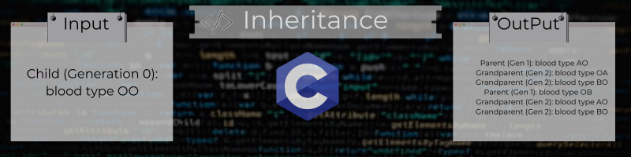

# cs50x-Data-Structures
Abstract Data Types. Queues, Stacks. Linked Lists. Trees, Binary Search Trees. Hash Tables. Tries.

## Fifty Week Projects:

## Lab

### [Inheritance](https://github.com/Henalecam/cs50x-Data-Structures/tree/main/inheritance)

The program we'll write will be called **inheritance**. and will determinate possible alleles combinations of a child based on the alleles of their parents and grandparents.



## Problems

### [Speller](https://github.com/Henalecam/cs50x-Data-Structures/tree/main/speller)

The program we'll write will be called **speller**. and will check a text for misspelled words.

Example:

```bash

$ ./speller texts/lalaland.txt
MISSPELLED WORDS

[...]
AHHHHHHHHHHHHHHHHHHHHHHHHHHHT
[...]
Shangri
[...]
fianc
[...]
Sebastian's
[...]

WORDS MISSPELLED:
WORDS IN DICTIONARY:
WORDS IN TEXT:
TIME IN load:
TIME IN check:
TIME IN size:
TIME IN unload:
TIME IN TOTAL:

```
